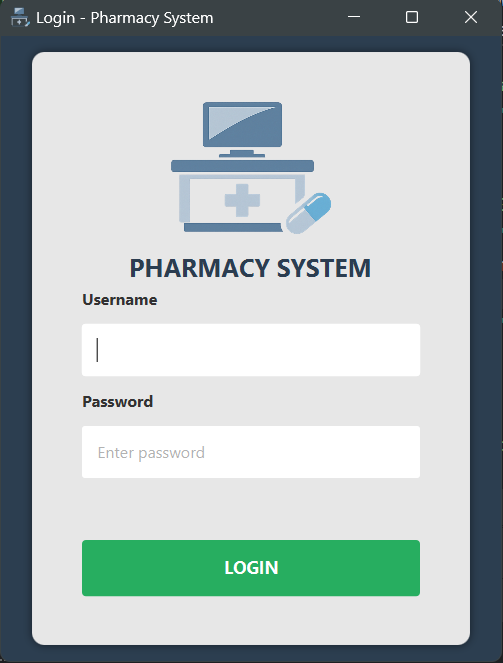
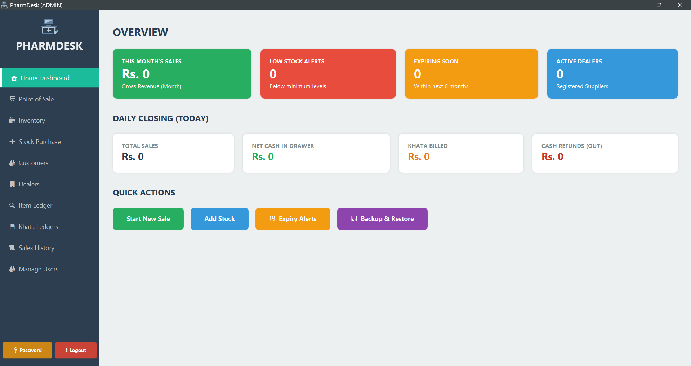
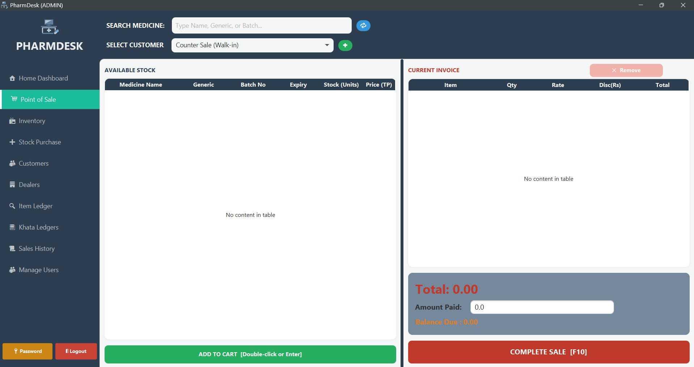

# PharmDesk
### Wholesale Edition · Desktop · Java 25 + JavaFX + SQLite

A complete, offline pharmacy management desktop application built for wholesale pharmaceutical distributors. Covers the full business cycle — purchasing, selling, inventory, credit ledgers, returns, thermal invoice printing, PDF archiving, expiry management, and automatic backups — with role-based access control and no external server dependencies.

---

## Screenshots

| Login | Dashboard | Point of Sale |
|-------|-----------|---------------|
|  |  |  |

---

## Features

### Point of Sale
- Fuzzy product search (Levenshtein distance) — tolerates typos on brand name and generic name
- Per-item discount percentage and bonus quantity
- Walk-in counter sales (cash, full payment enforced) and named credit customer sales (Khata)
- Live balance-due / change-due / advance-payment calculation as amount is typed
- Remove items from cart at any time before checkout
- Expiry warning dialog when cashier tries to sell near-expiry stock (configurable threshold)
- Hard block on expired medicine — cannot be sold under any circumstances
- Thermal receipt printed on 80mm roll via ESC/POS on checkout
- PDF invoice auto-archived to `C:\ProgramData\PharmDesk\Invoices\`

### Stock & Inventory
- Batch-level inventory — each purchase creates a distinct lot with its own expiry date and price
- Duplicate batch detection: re-purchasing the same batch number merges stock
- Trade price auto-calculated from cost price + margin percentage
- Admin stock adjustment with mandatory reason — every change written to a permanent audit log
- Edit product master data (name, generic, manufacturer, pack size, min stock level)
- Add new product shortcut (INSERT key by default)

### Expiry Management
- Dedicated screen showing all batches expiring within 90 days plus already-expired stock
- Colour-coded rows: dark red = expired · light red = ≤30 days · orange = 31–60 days · yellow = 61–90 days
- Summary cards showing counts per urgency level
- Admin write-off: zeros a batch's stock in one click, permanently logged to audit trail
- Expiry alert count shown on Dashboard

### Backup & Restore
- **Automatic backup on every close** — JVM shutdown hook fires whenever the app exits
- **Manual backup** from the Dashboard or the Backup & Restore screen at any time
- **All backups kept** — no rotation, no auto-deletion, full history preserved
- **Restore from list** — pick any backup from the screen and restore in one click
- **Restore from file** — browse to any `.db` file on disk (USB, network share, etc.)
- **Pre-restore safety copy** — before any restore the current database is saved automatically
- Backup filename format: `pharmacy_backup_YYYY-MM-DD_HH-mm-ss.db`
- All backups stored in `C:\ProgramData\PharmDesk\backups\`

### Sales History & Returns
- Date-filtered invoice browser with item-level drill-down
- **Invoice search** — search by invoice number or customer name in real time
- Customer name column visible directly in the invoice table
- Process item-level returns: cash refund or Khata credit
- **Proportional refund math** — cash refund is limited to the proportional cash actually paid; outstanding khata portion is automatically cancelled
- Return receipt PDF archived to `C:\ProgramData\PharmDesk\Returns\`
- Reprint any historical invoice at any time

### Khata Ledger System
- Separate ledgers for customers (receivables) and dealers (payables)
- Dynamic balance calculated live from the payments ledger — no stale stored balance
- Record cash payments against customers or dealers directly from the ledger view
- Full debit/credit history with dates and descriptions

### Dealer & Customer Management
- Register and edit dealers (company name, contact, drug license number)
- Dealer deletion blocked if payment history exists — preserves ledger integrity
- Register and edit customers (name, phone, CNIC)
- Walk-in customer placeholder (id = 1) is system-protected

### Dashboard
- Monthly sales total
- Low stock alert count (against per-product minimum stock levels)
- Expiry alert count (batches expiring within 6 months)
- Daily cash closing summary: total billed, net cash in drawer, Khata billed, refunds issued
- Quick-action buttons: New Sale, Add Stock, Expiry Alerts, Backup & Restore

### Security
- BCrypt password hashing (jBCrypt) — no plaintext, no MD5, no SHA
- Two roles: **ADMIN** and **SALESMAN**
- RBAC enforced at both sidebar and controller level
- Brute force protection: 5 failed login attempts triggers a 5-second lockout with live countdown
- All SQL uses `PreparedStatement` — no string-concatenated queries

### Keyboard Shortcuts
All shortcuts are configurable in `config.properties`.

| Key | Action |
|-----|--------|
| F1 | Point of Sale |
| F2 | Inventory |
| F3 | Stock Purchase |
| F4 | Sales History |
| F5 | Khata Ledgers |
| F6 | Customers |
| F7 | Dealers |
| F8 | Expiry Management |
| F9 | Dashboard |
| F10 | Backup Now (Backup screen) |
| F12 | Complete Sale / Checkout (POS screen) |
| INSERT | Add New Product (Inventory screen) |
| Ctrl+R | Process Return (Sales History screen) |

---

## Tech Stack

| Component | Technology |
|-----------|------------|
| Language | Java 25 |
| UI Framework | JavaFX 25 + FXML |
| Database | SQLite 3.42 (embedded, zero-install) |
| Build Tool | Apache Maven 3 (maven-shade-plugin fat jar) |
| PDF Generation | iTextPDF 5.5.13 |
| Password Hashing | jBCrypt 0.4 |
| Logging | SLF4J SimpleLogger → `C:\ProgramData\PharmDesk\pharmdesk.log` |
| Thermal Printing | ESC/POS over USB (80mm roll) |
| Architecture | MVC — Controller / DAO Interface / Model |

---

## Prerequisites

- **Java 25 JDK** with JavaFX modules (e.g. [Liberica JDK Full](https://bell-sw.com/pages/downloads/))
- **Apache Maven 3.8+** (included via `mvnw` wrapper — no separate install needed for dev)

No database server. No internet connection required at runtime.

---

## Development Setup

```bash
# 1. Clone
git clone https://github.com/Afzal-20/PharmDesk.git
cd PharmDesk

# 2. Run in development mode
.\mvnw.cmd javafx:run          # Windows
./mvnw javafx:run              # Linux / macOS

# 3. Build fat jar
.\mvnw.cmd package
# Output: target/PharmDesk.jar
```

> **Windows note:** Ensure `JAVA_HOME` points to JDK 25 before running mvnw.

On first launch the application:
1. Creates `C:\ProgramData\PharmDesk\` and all required subdirectories
2. Copies default `config.properties` if none exists
3. Creates the SQLite database and runs `schema.sql`
4. Seeds two default accounts:

| Username | Password | Role |
|----------|----------|------|
| `admin` | `admin123` | ADMIN |
| `salesman` | `sales123` | SALESMAN |

> **Change both passwords immediately after first login.**

---

## Configuration

The live config file is at `C:\ProgramData\PharmDesk\config.properties`. Edit with any text editor and restart the app.

```properties
# Invoice header
pharmacy.name=AL-SHIFA PHARMACY
pharmacy.address=123 Main Bazaar, Mardan
pharmacy.phone=0937-123456

# Database
db.name=wholesale_pharmacy.db

# Thermal printer — exact name as shown in Windows Devices & Printers
printer.name=Black Copper Turbo BC-85AC-G1

# Days before expiry to warn cashier at POS (0 = disable warning)
expiry.warn_days=30

# Keyboard shortcuts — use JavaFX KeyCode names (F1, F2, CTRL+N, etc.)
shortcut.pos=F1
shortcut.inventory=F2
shortcut.purchase=F3
shortcut.sales_history=F4
shortcut.khata=F5
shortcut.customers=F6
shortcut.dealers=F7
shortcut.expiry=F8
shortcut.dashboard=F9
shortcut.backup=F10
shortcut.checkout=F12
shortcut.add_product=INSERT
shortcut.process_return=CTRL+R
shortcut.backup_now=CTRL+B
```

---

## Data Directory

```
C:\ProgramData\PharmDesk\
    wholesale_pharmacy.db       ← live database
    config.properties           ← editable configuration
    pharmdesk.log               ← application log
    Invoices\                   ← PDF archive of every sale invoice
    Returns\                    ← PDF archive of every return receipt
    backups\                    ← automatic + manual database backups
```

---

## Project Structure

```
src/main/java/com/my/pharmacy/
├── App.java                        # Entry point + backup shutdown hook
├── config/
│   ├── DatabaseConnection.java     # SQLite connection factory (WAL + FK)
│   └── DatabaseSetup.java          # Schema init + default user seeding
├── controller/                     # 21 JavaFX controllers
├── dao/                            # DAO interfaces + SQL implementations
├── model/                          # POJOs (Product, Batch, Sale, Customer…)
├── service/
│   └── CartService.java            # Cart state management
└── util/
    ├── AppPaths.java               # All filesystem paths (single source of truth)
    ├── BackupService.java          # Backup / restore logic
    ├── CalculationEngine.java      # All financial arithmetic
    ├── ConfigUtil.java             # config.properties reader/writer
    ├── DialogUtil.java             # Styled confirmation dialogs
    ├── FuzzySearchUtil.java        # Levenshtein product search
    ├── InvoiceGenerator.java       # PDF invoice generation
    ├── NotificationService.java    # Non-blocking toast notifications
    ├── ShortcutManager.java        # Configurable keyboard shortcut registry
    ├── ThermalPrinter.java         # ESC/POS thermal printer engine
    ├── UserSession.java            # Singleton session store
    └── Validator.java              # Chainable input validation
```

---

## Role Permissions

| Feature | ADMIN | SALESMAN |
|---------|:-----:|:--------:|
| Point of Sale | ✅ | ✅ |
| View Inventory | ✅ | ✅ |
| View Sales History | ✅ | ✅ |
| Reprint Invoice | ✅ | ✅ |
| View Khata Ledgers | ✅ | ✅ |
| View Expiry Alerts | ✅ | ✅ |
| Stock Purchase Entry | ✅ | ❌ |
| Adjust Stock | ✅ | ❌ |
| Write Off Expired Batch | ✅ | ❌ |
| Edit Product | ✅ | ❌ |
| Process Sales Return | ✅ | ❌ |
| Record Khata Payment | ✅ | ❌ |
| Edit Dealer / Customer | ✅ | ❌ |
| Delete Dealer | ✅ | ❌ |
| Manual Backup | ✅ | ❌ |
| Restore Database | ✅ | ❌ |
| User Management | ✅ | ❌ |

---

## Database Schema

```
products                — Medicine master (name, generic, manufacturer, pack size, min stock)
batches                 — Stock lots (batch no, expiry, qty, cost, trade price) → products
customers               — Buyers (id=1 is the system walk-in placeholder)
dealers                 — Suppliers (company, contact, drug license)
sales                   — Invoice headers → customers
sale_items              — Invoice lines (qty, price, discount, returned qty) → sales, batches
purchase_history        — Immutable purchase log
payments                — Unified Khata ledger (entity_type = CUSTOMER | DEALER)
sale_returns            — Immutable return log
stock_adjustments_audit — Manual stock edit + write-off audit trail
users                   — Accounts (BCrypt hash, role, is_active)
```

---

## Invoice & Receipt Output

| Document | Location |
|----------|----------|
| Sale invoice (thermal) | Printed on 80mm roll via ESC/POS |
| Sale invoice (PDF) | `C:\ProgramData\PharmDesk\Invoices\Invoice_N.pdf` |
| Reprint (PDF) | `C:\ProgramData\PharmDesk\Invoices\Reprint_Invoice_N.pdf` |
| Return receipt (PDF) | `C:\ProgramData\PharmDesk\Returns\Return_Inv_N_timestamp.pdf` |

---

## Default Credentials

| Username | Password | Role |
|----------|----------|------|
| `admin` | `admin123` | ADMIN |
| `salesman` | `sales123` | SALESMAN |

Seeded on first launch only. Passwords are BCrypt-hashed before storage.

---

## Known Limitations

- **Single-user only.** Concurrent access from multiple machines is not supported.
- **Windows target.** Data paths use `C:\ProgramData\PharmDesk\`; non-Windows falls back to `~/PharmDesk/` for development only.
- **Backups are local.** Copy `backups\` to external storage regularly.
- **App restart required after restore.**
- **No reporting module.** Monthly P&L, tax summaries etc. are not included.
- **Price changes require a new batch.** Editing existing batch prices is intentionally blocked to preserve historical invoice accuracy.

---

## License

This project is released for personal and commercial use. See [LICENSE](LICENSE) for details.
